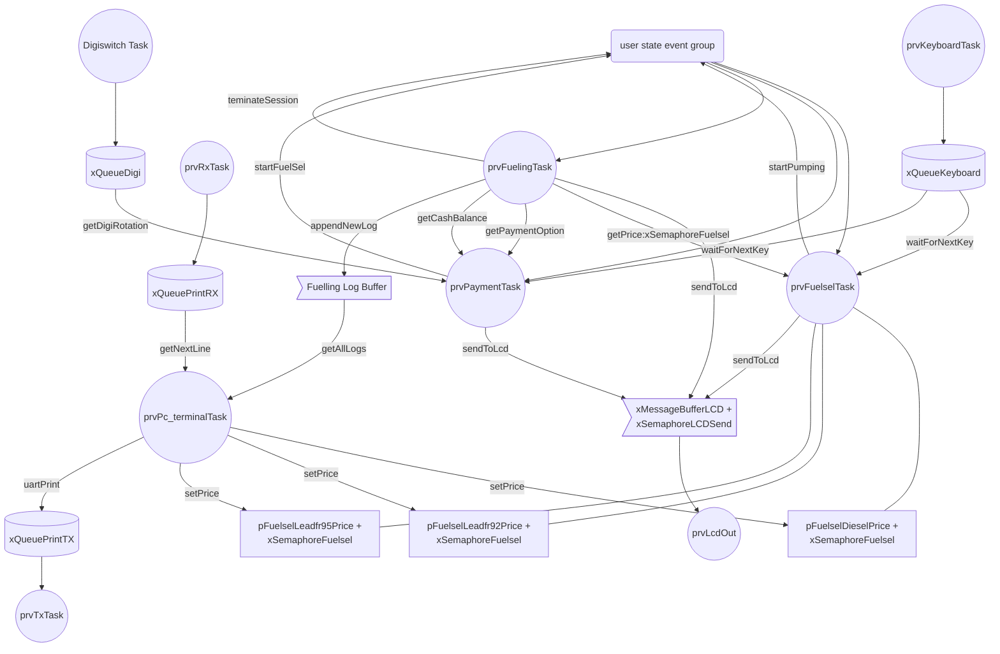

### Architecture

```mermaid
graph TD

  gsEG(user state event group)

  pay((prvPaymentTask))
  fuelsel((prvFuelselTask))
  fueling((prvFuelingTask))
  lcd((prvLcdOut))
  keyboard((prvKeyboardTask))
  digi((Digiswitch Task))
  uartRX((prvRxTask))
  uartTX((prvTxTask))
  pc((prvPc_terminalTask))
  
  keyQ[(xQueueKeyboard)]
  digiQ[(xQueueDigi)]
  rxQ[(xQueuePrintRX)]
  txQ[(xQueuePrintTX)]
  
  dieselPrice[pFuelselDieselPrice +<br/>xSemaphoreFuelsel]
  leadfr92Price[pFuelselLeadfr92Price +<br/>xSemaphoreFuelsel]
  leadfr95Price[pFuelselLeadfr95Price +<br/>xSemaphoreFuelsel]

  lcdB>xMessageBufferLCD +<br/>xSemaphoreLCDSend]
  logB>Fuelling Log Buffer]


  keyQ--waitForNextKey-->fuelsel
  gsEG-->fuelsel
  pc--setPrice-->dieselPrice
  pc--setPrice-->leadfr92Price
  pc--setPrice-->leadfr95Price
  fuelsel---dieselPrice
  fuelsel---leadfr92Price
  fuelsel---leadfr95Price
  fuelsel--sendToLcd-->lcdB
  fuelsel--startPumping-->gsEG
  

  uartRX-->rxQ
  rxQ--getNextLine-->pc
  pc--uartPrint-->txQ
  logB--getAllLogs-->pc
  txQ-->uartTX

  keyboard-->keyQ 
  keyQ--waitForNextKey-->pay
  gsEG-->pay
  digi-->digiQ
  digiQ--getDigiRotation-->pay
  pay--sendToLcd-->lcdB
  pay--startFuelSel-->gsEG


  lcdB-->lcd


  gsEG-->fueling
  fueling--sendToLcd-->lcdB
  fueling--getPrice:xSemaphoreFuelsel-->fuelsel
  fueling--getPaymentOption-->pay
  fueling--getCashBalance-->pay
  fueling--teminateSession-->gsEG
  fueling--appendNewLog-->logB
```