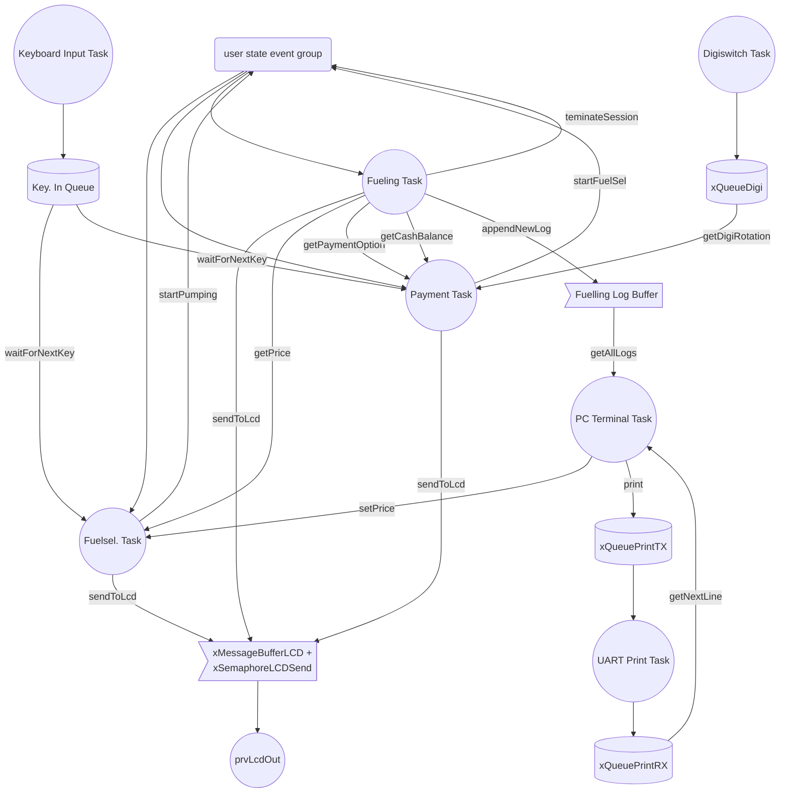

### Architecture

```mermaid
graph TD

  gsEG(user state event group)

  pay((Payment Task))
  fuelsel((Fuelsel. Task))
  fueling((Fueling Task))
  lcd((prvLcdOut))
  keyboard((Keyboard Input Task))
  digi((Digiswitch Task))
  uart((UART Print Task))
  pc((PC Terminal Task))
  
  keyQ[(Key. In Queue)]
  digiQ[(xQueueDigi)]
  rxQ[(xQueuePrintRX)]
  txQ[(xQueuePrintTX)]

  lcdB>xMessageBufferLCD +<br/>xSemaphoreLCDSend]
  logB>Fuelling Log Buffer]


  keyQ--waitForNextKey-->fuelsel
  gsEG-->fuelsel
  pc--setPrice-->fuelsel
  fuelsel--sendToLcd-->lcdB
  fuelsel--startPumping-->gsEG
  

  uart-->rxQ
  rxQ--getNextLine-->pc
  pc--print-->txQ
  logB--getAllLogs-->pc
  txQ-->uart

  keyboard-->keyQ 
  keyQ--waitForNextKey-->pay
  gsEG-->pay
  digi-->digiQ
  digiQ--getDigiRotation-->pay
  pay--sendToLcd-->lcdB
  pay--startFuelSel-->gsEG


  lcdB-->lcd


  gsEG-->fueling
  fueling--sendToLcd-->lcdB
  fueling--getPrice-->fuelsel
  fueling--getPaymentOption-->pay
  fueling--getCashBalance-->pay
  fueling--teminateSession-->gsEG
  fueling--appendNewLog-->logB
```